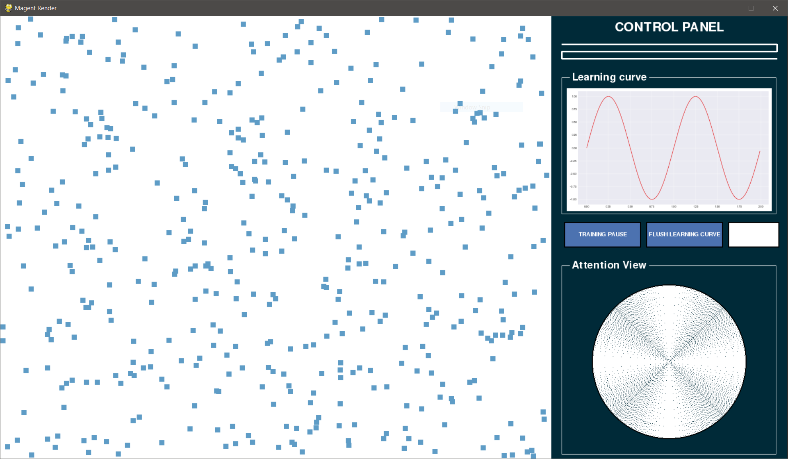

# MAgentRender
a interactive pygame client for MAgent

**features (will have)**

- PARALLEL RENDERING
- ASYNC RENDER WHILE TRAINING & SUPPORT TRAINING SUSPENSION
- REAL-TIME LEARNING CURVE
- ATTENTION: SELECT AN AGENT TO WATCH ITS LOCAL VIEW
- OTHERS

**Current UI**

